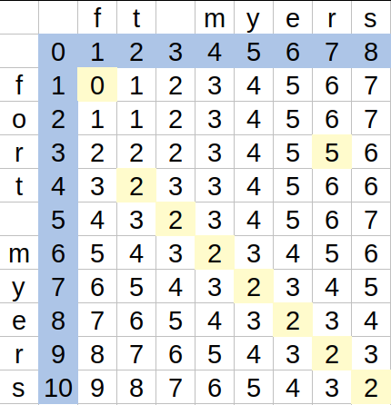

# Levenshtein distance

#### Definition, 정의
* 두 Sequence 사이의 차이를 측정하는 방법이다.
* 두 단어를 동일하게 만들기 위해서 편집( Insertion, Deletion, Substitution )을 한다고 했을때, 편집이 몇 번 일어나느냐가 이 Metric의 결과 값이다.

#### When, Why? 언제 사용하고, 왜 사용하는가?
* 두 단어를 비교할 때 사용된다.
* 어떤 전화번호부 LUT가 있고, 여기에 Seattle이라는 Key에 어떤 값이 들어 있는데, 만일 누군가가 오타로 Seattle을 오타로 Seatle 이라고 했다고 하면... 저기서 t가 하나 빠졌는지 글씨가 작으면 잘 안보여서, 왜 데이터가 안나오는지 궁금해 하다가, 한참 뒤에 발견한다. 오타가 있는 것을 알았고, 이를 개선하고 싶으면, 입력한 단어를 Seattle로 Correction해서 사용해야 하는데, 입력으로 들어온 데이터가 내가 원하는 데이터와 얼마나 차이가 나는지 알아보고 싶을 때 이 방법을 사용해 볼 수 있겠다. 여기서 나온 Integer value를 어떤 기준으로 관계를 설정할 것인지, Correction 할 것인지는 그 다음 문제임...
  * 정말로 Seatle 이라는 지명이 있을 수도 있기 때문에... 어떤 관계인지, Correction을 해야 하는 건지는 선택의 문제임.

#### How works? 어떻게 동작하는가?
* 우선 2차원 배열을 만든다. 각 Sequence 길이 보다 1이 더 큰 Matrix를 만든다.
* Matrix를 순회하면서 두 Character를 비교하는데, 두 단어가
  * 동일하면: 대각선 위의 값을 사용
  * 다르면: 현재 위치를 제외한 과거 3개 위치( 왼쪽, 위쪽, 대각선 위쪽 )의 값들에서 Minimum 값에서 1 더함.

#### Example
* "ft myers", "fort myers" 를 비교해보자. 인간은 똑똑해서 or만 집어 넣으면 된다는 것을 알고있다. 답은 2

* 아래는 Python으로 구현해 본 내용
```python
import sys

def verbose( mtrx ):

    for a in mtrx:
        print( ''.join( map( lambda x: '{:>2d}'.format( x ), a ) ) )
    print()

def levenstein( a, b, debug = False ):

    alen = len( a ) + 1
    blen = len( b ) + 1

    # Initialize matrix
    mtrx = [ [ 0 ] * alen for i in range( blen ) ]
    mtrx[ 0 ] = list( range( alen ) )
    for i, v in enumerate( range( blen ) ):
        mtrx[ i ][ 0 ] = i

    # Calculate
    for aidx, achar in enumerate( a ):

        ai = aidx + 1

        for bidx, bchar in enumerate( b ):

            bi = bidx + 1

            if achar == bchar:
                mtrx[ bi ][ ai ] = mtrx[ bi -1 ][ ai -1 ]
            else:
                mtrx[ bi ][ ai ] = min(
                    mtrx[ bi - 1 ][ ai -1 ],
                    mtrx[ bi ][ ai -1 ],
                    mtrx[ bi - 1 ][ ai ]
                ) + 1

        if debug:
            verbose( mtrx )

    return mtrx[ -1 ][ -1 ]


if __name__ == '__main__':

    args = list( map( str.strip, sys.argv[ 1: ] ) )
    if len( args ) == 3 and args[ -1 ].strip() == '-v':
        v = True
    else:
        v = False

    a, b = sorted( map( str.strip, args[ :2 ] ), key = len )
    print( 'a: {}'.format( a ) )
    print( 'b: {}'.format( b ) )
    print( levenstein( a, b, debug = v ) )
```

```bash
$ python3 levenstein.py "ft myers" "fort myers" -v
a: ft myers
b: fort myers

 0 1 2 3 4 5 6 7 8
 1 0 0 0 0 0 0 0 0
 2 1 0 0 0 0 0 0 0
 3 2 0 0 0 0 0 0 0
 4 3 0 0 0 0 0 0 0
 5 4 0 0 0 0 0 0 0
 6 5 0 0 0 0 0 0 0
 7 6 0 0 0 0 0 0 0
 8 7 0 0 0 0 0 0 0
 9 8 0 0 0 0 0 0 0
10 9 0 0 0 0 0 0 0

 0 1 2 3 4 5 6 7 8
 1 0 1 0 0 0 0 0 0
 2 1 1 0 0 0 0 0 0
 3 2 2 0 0 0 0 0 0
 4 3 2 0 0 0 0 0 0
 5 4 3 0 0 0 0 0 0
 6 5 4 0 0 0 0 0 0
 7 6 5 0 0 0 0 0 0
 8 7 6 0 0 0 0 0 0
 9 8 7 0 0 0 0 0 0
10 9 8 0 0 0 0 0 0

 ...

 0 1 2 3 4 5 6 7 8
 1 0 1 2 3 4 5 6 0
 2 1 1 2 3 4 5 6 0
 3 2 2 2 3 4 5 5 0
 4 3 2 3 3 4 5 6 0
 5 4 3 2 3 4 5 6 0
 6 5 4 3 2 3 4 5 0
 7 6 5 4 3 2 3 4 0
 8 7 6 5 4 3 2 3 0
 9 8 7 6 5 4 3 2 0
10 9 8 7 6 5 4 3 0

 0 1 2 3 4 5 6 7 8
 1 0 1 2 3 4 5 6 7
 2 1 1 2 3 4 5 6 7
 3 2 2 2 3 4 5 5 6
 4 3 2 3 3 4 5 6 6
 5 4 3 2 3 4 5 6 7
 6 5 4 3 2 3 4 5 6
 7 6 5 4 3 2 3 4 5
 8 7 6 5 4 3 2 3 4
 9 8 7 6 5 4 3 2 3
10 9 8 7 6 5 4 3 2

2
```

#### Reference
* https://en.wikipedia.org/wiki/Levenshtein_distance
* https://madplay.github.io/post/levenshtein-distance-edit-distance
